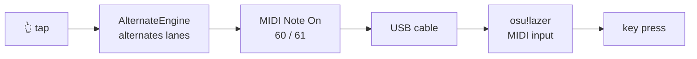

# Alternate

**Your phone as a USB MIDI keypad for osu!**

[](LICENSE)
[](https://github.com/shamik230/alternate/actions/workflows/ci.yml)

*Русская версия: [README.ru.md](README.ru.md)*


---

Alternate turns an Android phone into a MIDI keypad and plugs it into osu!
over a USB cable. The whole screen is one button. Every tap fires one of two
notes, **alternating** — so a single finger produces the alternating key
presses a stream needs, at speeds no single key can reach.

That is the entire idea, and the app does nothing else.



## Why MIDI

Because osu!lazer speaks it natively. There is no bridge to install, no driver,
no key-mapping utility in the middle — the phone appears as a MIDI device and
the game reads it as a keyboard. One cable, one setting in the game, done.

## Requirements

- An Android phone, **Android 7.0** or newer, that supports **USB MIDI**
  (most do; the app tells you on the first screen if yours does not)
- A **data** USB cable — a charge-only cable will not enumerate the device
- **osu!lazer** on the computer

## Getting started

1. **Connect.** Plug the phone into the computer with a data cable. Open the
   USB notification on the phone and choose **MIDI**.
2. **Turn MIDI on in the game.** osu!lazer reads MIDI natively; enable MIDI
   input in the game's input settings.
3. **Pick the device** in Alternate and press **START**. With nothing
   plugged in the button reads **DEMO** instead: the pad opens and works,
   the MIDI just goes nowhere, so you can try the feel before finding a cable.
4. **Bind the keys.** In the game, bind the two osu! keys while tapping the
   pad, so each lane lands on the key you want. The defaults are MIDI notes
   **60** and **61** (C4 and C#4) on channel 3 — change them under
   *Settings → MIDI* if the game expects something else.
5. **Silence the phone.** A heads-up notification steals the touch focus and
   ends the run. Turn on *Settings → Do Not Disturb while playing*, or use
   your phone's game mode.

Press Back twice to leave the pad.

## The pad

 

| Readout | Meaning |
| --- | --- |
| **CHAIN** | current unbroken run of taps |
| **BPM** | tempo, as a 1/4 stream — the way osu! maps are labelled |
| **TOTAL** | taps this session |
| gauge | the same BPM, as a column of blocks that light up |

The gauge is not linear. Nobody streams below 100, so a linear 0–260 bar would
waste its bottom third and give a few pixels to the stretch that actually
decides whether you pass a map. Instead each zone gets a share of the bar
sized by how much it matters: warm-up to 140 takes the first third, working
tempo to 200 the second, and everything above 200 splits the rest. 220 and up
sits near the top, which is what "over the limit" should look like.

The gauge is one colour. Height already carries the whole message, and a
colour ramp on top of it was a second voice saying the same thing.

## Settings

| Setting | Default | Notes |
| --- | --- | --- |
| Debounce | 12 ms | Shortest accepted gap between taps. Swallows a finger rolling off the glass. Real alternate tapping at 20 taps/second is a 50 ms period, so anything up to ~30 ms is safe. |
| Chain window | 700 ms | Pause after which the chain counter resets. |
| Left / right note | 60 / 61 | Must match what the game binds. |
| Keep screen on | on | |
| Hide system bars | on | Fullscreen on every screen. A stray edge swipe mid-run costs more than a hidden clock. |
| Lite graphics | off | Drops waves, sparks, orbital brackets, text glow and the counter punch. Try it if frames stutter. |
| Do Not Disturb while playing | off | Needs a one-time Android permission. Restores your previous setting on exit. |
| Show tap diagnostics | off | Overlays last interval, dropped taps and held notes. |

## Latency

The app is built around one number: the time from glass to MIDI. What it does
about it:

- **The MIDI note goes out first.** On a tap, the engine decides the note and
  the byte is on the wire before any animation state is touched. The tempo
  maths — trimmed mean, smoothing — runs in the frame loop afterwards.
- **Nothing allocates on the hot path.** Engine state is primitive arrays,
  the MIDI message buffer is allocated once, particle pools are ring buffers
  of floats. No garbage means no collection pause mid-stream.
- **Unbuffered touch dispatch** on Android 13+, which saves up to a frame.
- **The fastest display mode** at the current resolution is requested at
  startup: more frames per second also means the touch sensor is polled
  more often.
- **Event timestamps, not handler timestamps.** Intervals are measured from
  the input event's own clock, so a busy UI thread cannot skew the tempo.
- **Sending is synchronous** on the touch thread. Handing the write to
  another thread would add scheduling to the latency for nothing.

Turn on *Show tap diagnostics* to see the last interval and how many presses
the debounce is eating.

## Building

```bash
./gradlew assembleDebug
```

Unit tests (no device needed):

```bash
./gradlew test
```

Instrumented tests (needs a connected device or emulator):

```bash
./gradlew connectedAndroidTest
```

A release build is signed with the debug key unless you supply your own —
see [docs/RELEASING.md](docs/RELEASING.md) and
see [CONTRIBUTING.md](CONTRIBUTING.md).

## Project layout

```
keypad/     Engine, tempo maths, animation state. No Android dependency,
            so plain JVM tests cover the parts that matter.
data/       MIDI port, settings, Do Not Disturb.
ui/hud/     Drawing primitives and the instrument-panel components.
ui/screens/ The four screens.
```

`AlternateEngine`, `TapStats` and `BpmScale` deliberately have no Android
imports. That is what lets the interesting logic be tested without a phone —
and it is the seam an iOS port would start from.

## iOS

Not planned, and worth being straight about why: **an iPhone cannot act as a
USB MIDI device.** Android can pretend to be a MIDI keyboard over the cable;
iOS has no equivalent mode. What is left is Network MIDI over Wi-Fi or
Bluetooth LE MIDI, and both add latency and jitter that a 200 BPM stream will
feel. The logic layer would port cleanly; the thing that makes this app worth
using would not.

## Contributing

Issues and pull requests are welcome. See [CONTRIBUTING.md](CONTRIBUTING.md).

## License

[MIT](LICENSE).

The bundled typeface, [Tektur](https://github.com/hyvyys/Tektur), is licensed
separately under the SIL Open Font License 1.1 — see
[third_party/tektur/OFL.txt](third_party/tektur/OFL.txt) and [NOTICE](NOTICE).
