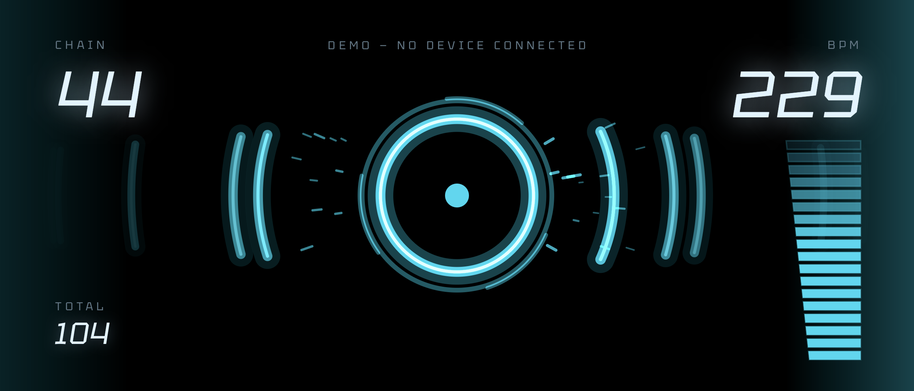
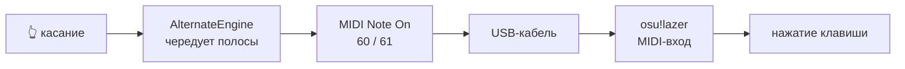
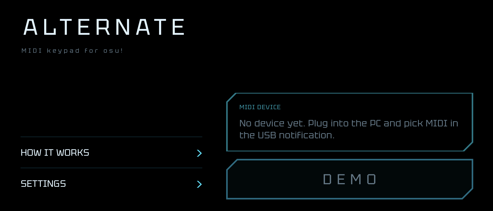
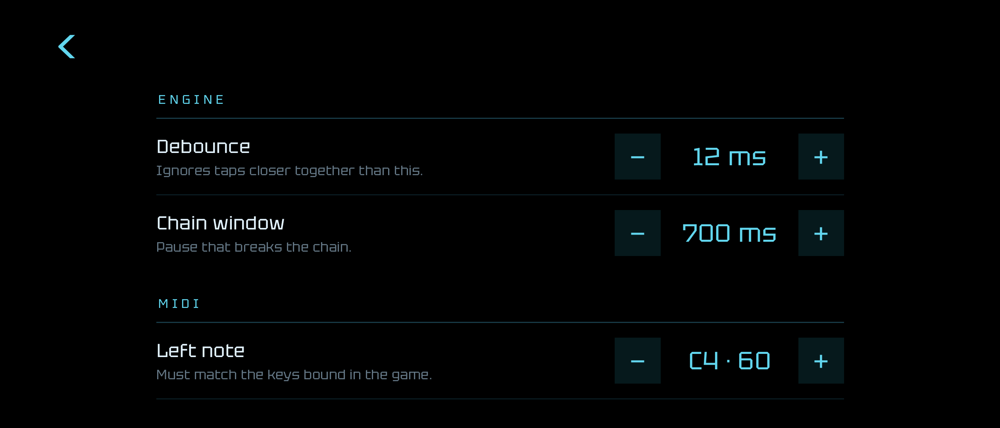

# Alternate

**Телефон как USB MIDI-падд для osu!**

[](LICENSE)

*English version: [README.md](README.md)*



---

Alternate превращает Android-телефон в MIDI-падд и подключает его к osu!
обычным USB-кабелем. Весь экран — одна кнопка. Каждое касание отправляет одну
из двух нот, **чередуя** их: один палец выдаёт то самое попеременное нажатие
двух клавиш, которое нужно для стрима, на скорости, недостижимой одной
клавишей.

Это вся идея, и больше приложение ничего не делает.



## Почему MIDI

Потому что osu!lazer понимает его нативно. Не нужен мост, драйвер или утилита
для переназначения клавиш — телефон появляется как MIDI-устройство, и игра
читает его как клавиатуру. Один кабель, одна галочка в игре.

## Что нужно

- Android-телефон, **Android 7.0** или новее, с поддержкой **USB MIDI**
  (есть почти везде; приложение скажет на первом экране, если её нет)
- **Кабель для передачи данных** — кабель «только зарядка» не подойдёт
- **osu!lazer** на компьютере

## Как начать

1. **Подключите.** Воткните телефон в компьютер кабелем для данных. Откройте
   USB-уведомление на телефоне и выберите **MIDI**.
2. **Включите MIDI в игре.** osu!lazer читает MIDI нативно — включите
   MIDI-вход в настройках ввода игры.
3. **Выберите устройство** в Alternate и нажмите **START**. Если ничего не
   подключено, на кнопке будет **DEMO**: падд откроется и будет работать,
   просто MIDI никуда не уйдёт — можно пощупать до того, как найдётся кабель.
4. **Забиндите клавиши.** В игре назначьте две клавиши osu!, нажимая на падд,
   чтобы каждая полоса попала на нужную клавишу. По умолчанию это MIDI-ноты
   **60** и **61** (C4 и C#4) на канале 3 — их можно поменять в
   *Settings → MIDI*, если игра ждёт другие.
5. **Заглушите телефон.** Всплывающее уведомление крадёт фокус касания и
   обрывает ран. Включите *Settings → Do Not Disturb while playing* или
   игровой режим телефона.

Чтобы выйти с падда, нажмите «Назад» дважды.

## Падд

 

| Показание | Что значит |
| --- | --- |
| **CHAIN** | текущая непрерывная серия касаний |
| **BPM** | темп как 1/4-стрим — так подписаны карты в osu! |
| **TOTAL** | касаний за сессию |
| шкала | тот же BPM, в виде столбика ячеек, которые загораются |

Шкала не линейная. Ниже 100 никто не стримит, поэтому линейная шкала 0–260
впустую тратила бы нижнюю треть и отдавала бы несколько пикселей тому
диапазону, который на деле решает, пройдёте вы карту или нет. Вместо этого
каждая зона получает долю шкалы по своей важности: разогрев до 140 — первая
треть, рабочий темп до 200 — вторая, всё выше 200 делит остаток. 220 и выше
оказывается у самого верха — именно так и должно выглядеть «за пределом».

Шкала одноцветная. Высота и так передаёт всё, что нужно, а цветовой градиент
поверх неё был вторым голосом, говорящим то же самое.

## Настройки

| Настройка | По умолчанию | Комментарий |
| --- | --- | --- |
| Debounce (дребезг) | 12 мс | Минимальный принимаемый интервал между касаниями. Отсекает двойное срабатывание от переката пальца. Реальный альт-тап 20 касаний/с — это период 50 мс, так что всё до ~30 мс безопасно. |
| Chain window | 700 мс | Пауза, после которой счётчик серии сбрасывается. |
| Левая / правая нота | 60 / 61 | Должны совпадать с тем, что забиндено в игре. |
| Keep screen on | вкл | |
| Hide system bars | вкл | Полноэкранный режим на всех экранах. Случайный свайп с края посреди рана стоит дороже спрятанных часов. |
| Lite graphics | выкл | Отключает волны, искры, орбиты, свечение текста и пружину счётчика. Попробуйте, если кадры дёргаются. |
| Do Not Disturb while playing | выкл | Нужно одноразовое разрешение Android. На выходе возвращает ваш прежний режим. |
| Show tap diagnostics | выкл | Показывает последний интервал, отброшенные касания и удерживаемые ноты. |

## Задержка

Приложение построено вокруг одного числа — времени от стекла до MIDI. Что для
этого сделано:

- **MIDI-нота уходит первой.** При касании движок определяет ноту, и байт
  оказывается на проводе до того, как тронуто хоть одно состояние анимации.
  Расчёт темпа — усечённое среднее, сглаживание — идёт потом, в кадровом цикле.
- **На горячем пути нет аллокаций.** Состояние движка — примитивные массивы,
  буфер MIDI-сообщения выделен один раз, пулы частиц — кольцевые буферы из
  float. Нет мусора — нет паузы сборщика посреди стрима.
- **Небуферизованная доставка касаний** на Android 13+ экономит до кадра.
- **Самый быстрый режим экрана** при текущем разрешении запрашивается на
  старте: больше кадров в секунду — чаще опрашивается и сам сенсор.
- **Метки времени события, а не обработчика.** Интервалы меряются по часам
  самого события ввода, поэтому загруженный UI-поток не искажает темп.
- **Отправка синхронная**, в потоке касания. Передача записи в другой поток
  добавила бы к задержке планирование и ничего не дала бы взамен.

Включите *Show tap diagnostics*, чтобы увидеть последний интервал и сколько
нажатий съедает дребезг.

## Сборка

```bash
./gradlew assembleDebug
```

Юнит-тесты (устройство не нужно):

```bash
./gradlew test
```

Инструментальные тесты (нужен телефон или эмулятор):

```bash
./gradlew connectedAndroidTest
```

Релизная сборка подписывается debug-ключом, пока вы не подставите свой —
см. [docs/RELEASING.md](docs/RELEASING.md) и
см. [CONTRIBUTING.md](CONTRIBUTING.md).

## Структура проекта

```
keypad/     Движок, расчёт темпа, состояние анимации. Без зависимостей от
            Android, поэтому обычные JVM-тесты покрывают самое важное.
data/       MIDI-порт, настройки, режим «Не беспокоить».
ui/hud/     Примитивы отрисовки и компоненты приборной панели.
ui/screens/ Четыре экрана.
```

У `AlternateEngine`, `TapStats` и `BpmScale` сознательно нет ни одного импорта
Android. Именно это позволяет тестировать интересную логику без телефона — и
это же тот шов, с которого начался бы порт на iOS.

## iOS

Не планируется, и стоит честно сказать почему: **iPhone не умеет работать как
USB MIDI-устройство.** Android может притвориться MIDI-клавиатурой по кабелю,
у iOS такого режима просто нет. Остаются Network MIDI по Wi-Fi и Bluetooth LE
MIDI — оба добавляют задержку и джиттер, которые на 200 BPM будут заметны.
Слой логики перенёсся бы чисто; то, ради чего это приложение существует, — нет.

## Участие

Issue и pull request приветствуются. См. [CONTRIBUTING.md](CONTRIBUTING.md).

## Лицензия

[MIT](LICENSE).

Встроенный шрифт [Tektur](https://github.com/hyvyys/Tektur) лицензирован
отдельно, под SIL Open Font License 1.1 — см.
[third_party/tektur/OFL.txt](third_party/tektur/OFL.txt) и [NOTICE](NOTICE).
